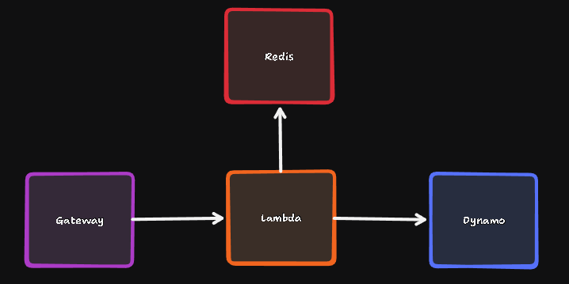
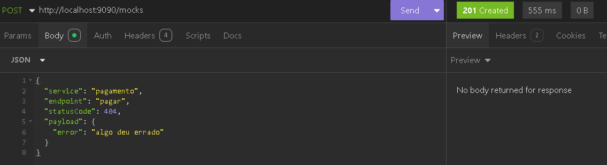
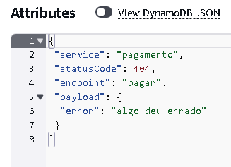
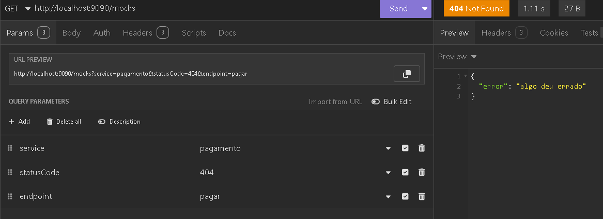
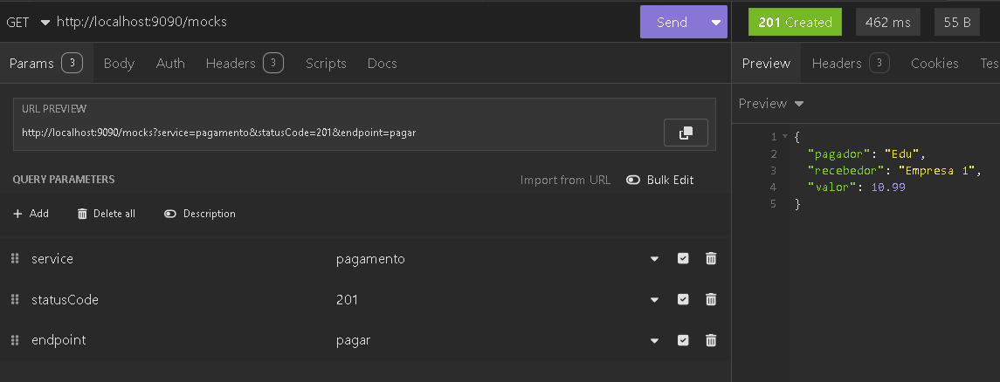

### Objetivo

Permitir o cadastro de mocks para simular integrações de serviços externos, visando contornar possíveis instabilidades

### Requisitos

- O usuário deve conseguir cadastrar o serviço, o endpoint e o payload que deseja receber ao chamar o mock

- O usuário deve conseguir cadastrar um endpoint de sucesso e um de erro para o mesmo serviço/endpoint

- O usuário deve conseguir editar o payload de um endpoint

- O usuário deve conseguir cadastrar o status que deseja receber em um determinado endpoint

### Estrutura final (ainda não implementada)



### Endpoints

## Criar

```http
  POST /mocks
```

**Body**
| Parâmetro | Tipo | Descrição |
| :---------- | :--------- | :---------------------------------- |
| `service` | `string` | **Obrigatório**. Nome do serviço |
| `endpoint` | `string` | **Obrigatório**. Endpoint que será simulado (sem a barra) |
| `statusCode` | `number` | **Obrigatório**. Status que deverá ser retornado |
| `payload` | `json` | **Obrigatório**. Objeto que será retornado|

**Exemplo**

```
curl --request POST \
  --url http://<endereço>/mocks \
  --header 'Content-Type: application/json' \
  --data '{
	"service": "pagamento",
	"endpoint": "pagar",
	"statusCode": 200,
	"payload": {
		"pagador": "Edu",
		"valor": 10.99,
		"recebedor": "Empresa 1"
	}
}'
```

## Recuperar

Quando é feito o GET, será retornado o resultado esperado do serviço que está sendo simulado

```http
  GET /mocks
```

**Query Params**
| Parâmetro | Tipo | Descrição |
| :---------- | :--------- | :---------------------------------- |
| `service` | `string` | **Obrigatório**. Nome do serviço |
| `endpoint` | `string` | **Obrigatório**. Endpoint que deseja do serviço |
| `statusCode` | `number` | **Obrigatório**. Status que seja retornado |

**Exemplo**

```
curl --request GET \
  --url 'http://<endereço>/mocks?service=pagamento&statusCode=200&endpoint=pagar' \
```

#

### Na Prática

**Criação**:




**Busca**:




### O que falta

- Melhorar tratamento de erro
- Inclusão de log(?)
- Configurar lambda e api gateway
- Entendimento do context que é usado dentro do código
